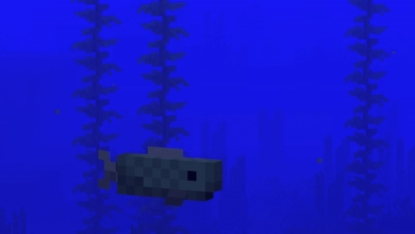

# Battaglia Navale

## Descrizione
Battaglia Navale è un gioco classico sviluppato, in questo caso, con Windows Forms in C#. 
Il progetto permette a due giocatori di sfidarsi con navi generate casualmente e cercando di affondare quelle dell'avversario.
Al suo interno troviamo il codice per un server e per i client, di base impostati per runnare sulla stessa macchina.
Essi comunicano tramite il protocollo TCP sulla porta 50000 (potete personalizzarla nel codice).

##### (Opzionale) Per giocare su diversi dispositivi:
- Rete locale: basta cambiare gli IP nel codice del Client-Navale.
- Con un amico a distanza: usare programmi come ```LogMeIn Hamachi``` e modificare gli IP nel codice del Client-Navale.

## Funzionalità
- Interfaccia grafica realizzata con Windows Forms
- Modalità giocatore vs giocatore (in locale di base)
- Posizionamento casuale delle navi
- Griglia interattiva per selezionare le coordinate di attacco
- Indicazione visiva di colpi a segno e mancati
- Sistema di gestione della vittoria/sconfitta
- Aggiornamenti dinamici
- Chat di gioco tra giocatori

## Requisiti di sistema
- .NET Framework 4.7.2 o superiore
- Windows 10/11
- Visual Studio 2022 o superiore per la compilazione del codice sorgente
- Pacchetto NuGet NewtonsoftJson

## Installazione
```
1. Clonare il repository:
   
   git clone https://github.com/ZapGamer/Battaglia_Navale.git
   
2. Aprire la soluzione in Visual Studio

3. Compilare ed eseguire il progetto (lo trovate nelle rispettive cartelle bin)
```

## Utilizzo
1. Avviare l'applicazione server e due client
2. Iniziare la battaglia selezionando le coordinate di attacco
3. Continuare fino alla vittoria di uno dei giocatori

## Buon divertimento!
Se riscontrate problemi, contattatemi pure tramite una issue su questa repository (ignorerò tutte quelle riguardanti le MessageBox, essendo problemi minori che dipendono dalla velocità di trasmissione e non causano errori nel codice).
